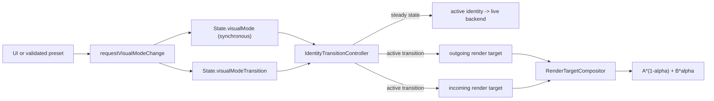

# Visual Identities

This document records the active visual identity system in `src/visuals/`.

## Purpose

Visual identities are deep visual modules. Each identity hides its own color theory, movement dynamics, network or polygon rules, and performance tradeoffs behind the same small contract:

```ts
export interface VisualIdentity {
    readonly id: string;
    readonly name: string;
    readonly usesSharedSimulation?: boolean;
    draw(backend: VisualRendererBackend, particles: Particle[], shockwaves: Shockwave[], context?: VisualIdentityDrawContext): void;
    syncPosition?(timeSec: number): void;
}
```

`PlexusRenderer` remains the render orchestrator. It synchronizes playback time, accepted analysis frames, beat and cue event indexes, modulation, visual tuning, and `VisualDirectorFSM` output. It does not contain mode-specific drawing branches. At the end of each draw cycle it delegates to `IdentityTransitionController`, which selects either the steady-state direct path or the renderer-owned transition path.



`requestVisualModeChange()` is the only runtime writer of `State.visualMode`. It changes the logical selection immediately. When playback or offline export is active, it also writes one `VisualModeTransition` record (`from`, `to`, `generation`, `startTimeSec`, `durationSec`); paused/stopped changes clear the record and do not dual-render. The start is anchored to `State.currentTime` for playback and exact `State.exportTime` for export. Duration is clamped to `0.1..4.0` seconds.

`IdentityTransitionController` owns transition consumption and completion. `computeCrossfadeAlpha()` derives a smoothstep alpha from the song/export clock. Before the recorded start (including a backward time jump) or on completion, the controller clears the transition and draws only the incoming identity. A record that no longer targets the logical mode is bypassed. In steady state it does not call the compositor.

`P5RenderTargetCompositor` implements `RenderTargetCompositor` with exactly two constructor-allocated `p5.Graphics` targets. Active transition frames clear both targets, resize them only when the live surface size changes, and composite with Canvas2D `source-over`: outgoing at `1 - alpha`, incoming at `alpha`. Additive `lighter` blending is not part of identity replacement.

Shared particle/shockwave simulation advances exactly once per transition frame. Normally the incoming identity receives `advanceSharedSimulation: true` and the outgoing identity receives `false`. If the incoming identity does not declare `usesSharedSimulation`, ownership remains with a shared-simulation outgoing identity. Effects must honor the flag before updating or deleting shared pool entries.

## Visual Score Tuning Handoff

Visual identities do not parse or directly consume the Visual Score DSL. When
`featureFlags.semanticResolver` is enabled, the offline semantic chain produces
`ChoreographyFrame` values containing motif intensity/density/motion, novelty, and
typed transition endpoints. `SemanticResolver` translates the active frame into
clamped `State.targetTuning`; the existing tuning morph then exposes the result to the
selected identity through `State.visualTuning`.

This lets the same motif or transition influence each identity through its own tuning
vocabulary without coupling `src/semantics/` to renderer classes. Source and target
motif deltas are blended by transition progress. The fast audio-reactive channel is
unchanged: `VisualDirectorFSM` remains the sole owner of `State.modulation` and
`State.directorOutput`, and identities must not read `ChoreographyFrame` directly.

## Registry

`src/visuals/StyleRegistry.ts` owns registered styles behind a private `Map`. Its public API is intentionally small:

- `register(identity: VisualIdentity): void`
- `get(id: string): VisualIdentity`
- `createDefaultStyleRegistry(): StyleRegistry`

Unknown style ids fall back to the `classic` identity. If `classic` itself has not been registered, `get()` throws because the application has been composed incorrectly.

`createDefaultStyleRegistry()` registers the current built-in identities:

- `classic`
- `temporal`
- `dark-techno`
- `organic-ambient`
- `cyberpunk`
- `cosmic-wormhole`
- `hero` (registered only when `featureFlags.heroEffect` is enabled)

There is no module-level writable global registry. The app composes a registry instance in `src/main.ts` and passes it to `startPlexusRenderer()`.

## Built-In Identities

### Classic

File: `src/visuals/ClassicPlexusEffect.ts`

The original Plexus look: particle network, central glow, beat shockwaves, polygon flashes, and deterministic LOW_DROP glitch offsets. Color buffers are private fields on the identity instance, not module-level writable arrays.

### Temporal

File: `src/visuals/TemporalMusicEffect.ts`

A track-aware identity that consumes `TrackAnalysis` sections, recurring patterns, visual features, cues, and modulation to drive background tone, network density, polygon color, central mechanism rings, and pattern resonance. It keeps color buffers inside the identity object and passes numeric RGB components to ring drawing.

### Dark Techno

File: `src/visuals/DarkTechnoIdentity.ts`

Strict monochrome industrial language. It uses sharp white/gray line work, sparse high-brightness strobe polygon flashes, and disables `radialGlow` entirely to preserve a raw digital dark aesthetic.

### Organic Ambient

File: `src/visuals/OrganicAmbientIdentity.ts`

Slow, fluid, fog-like identity. It avoids sharp network lines and instead draws pastel green, blue, and earth-tone radial glow layers around particles so they blend into a soft field.

### Cyberpunk

File: `src/visuals/CyberpunkIdentity.ts`

High-contrast neon magenta and cyan identity. It simulates chromatic aberration by drawing connections twice with small offsets and uses deterministic high-tension glitch offsets during buildup/drop pressure.

### Cosmic Wormhole

File: `src/visuals/CosmicWormholeIdentity.ts`

A 3D "tunnel flight" identity. It maintains a fixed dust pool (one grain per spectral band and depth layer) in cylinder space: every grain has an angular position `theta`, a band assignment, and an immutable normalized `depthPhase`. A single shared travel phase advances each frame; live depth is derived from the grain phase, travel phase, and current horizon. Horizon morphs therefore cannot accumulate density bands in individual grains. The field of view is bound to canvas height (not width) so the tube always fits vertically on a 16:9 surface, and the grains draw only as motion-blurred radial streaks (`backend.line`) — there are no center circles.

Music reactivity is sourced from precomputed state, never realtime DSP:

- The 24-band `State.currentFrame.perceptualSpectrum` is distributed around the tube wall, one angular sector per band, and each band's energy drives the brightness and thickness of its grains.
- Flight speed scales with `State.modulation.macroMomentum` and `State.modulation.densityDrive`; the dust spiral twist scales with `kineticTension`, `centripetalOrbit`, and the `wormholeWarp` tuning value.
- `State.denseImpactFlash` flashes grain brightness and thickness on dense impacts (a wormhole-rim flash); `State.directorOutput.glitchIntensity` adds a deterministic per-index coordinate shift during `GLITCH_LOW_DROP`.
- `State.currentFeatures.vocal` and `melody` shift the grain hue through `hueToRgbInto()` with an identity-owned RGB tuple.

The tunnel curvature is event-driven, not constant. A decaying `curveImpulse` fires whenever `State.directorOutput.state` changes (i.e. when the performance-automation preset transitions), and `kineticTension`/`centripetalOrbit` add a gentle continuous lean. The whole bend is scaled by the dedicated `wormholeCurve` master (`0` = perfectly straight, `1` = full bends) so the tuning panel can override any preset.

The scene is wrapped by a parallax universe that is independent of the tube: an absolute-world starfield plus a deeper layer of large, faint `radialGlow` galaxies (gated by `shouldUseExpensiveGlow`). Both subtract the curving camera offset before projection, so the background sweeps as the tunnel bends and streams as it travels forward. `syncPosition()` re-anchors travel, automation transition, starfield, and galaxy state after seek/stop so identical song positions reproduce identical geometry. `wormholeDepthCoherence` can deterministically compress immutable depth cohorts for authored rib character without restoring mutable depth damage; `wormholeRing` separately blends live depths toward discrete rings.

The clip preset family keeps ring alignment disabled except for authored segmented roles:
collapse uses a restrained `0.35` ring amount, while sparse intentionally uses a strong
segmented/ribbed field. `ringBlend()` compresses grains toward depth-layer centers, so ring
values remain explicit role-level choices. Longer continuity values provide perspective and
velocity without introducing new scene objects.

All pools and color tuples are allocated once in the constructor, glitch and parallax noise come from a deterministic `pseudoNoise()` hash, and drawing stays on `backend.line` plus the gated galaxy `radialGlow`.

### Hero

File: `src/visuals/HeroEffectIdentity.ts`

A timeline-forward identity built around a fixed playhead dot near the lower-left area of the screen. Beat event dots travel right-to-left along a horizontal lane near the bottom of the viewport. Dot positions are not updated by velocity or retained per-dot state; each X coordinate is computed directly from `event.time - State.currentTime`, making the identity deterministic, stateless, scrub-safe, seek-safe, and offline-export safe.

Hero reads `State.visualTuning.heroEventMode` to decide its event source. Mode `0` renders all accepted audio events from `State.events`. Mode `1` keeps the UI label "audio drums only" for compatibility, but its documented meaning is percussive/high-transient visual events from accepted `BeatEvent` entries, not literal drum stem detection. Mode `2` renders metronome beeps only. Audio-event dots that have reached or just passed the playhead disappear or produce a localized flash. Dot positions are deterministic from `event.time - State.currentTime`; dot size scales from `event.intensity` and `State.visualTuning.circleSize`. `event.type` is a visual impact category: type 1 uses the standard lane dot, type 2 dense impact events are larger and brighter, and type 3 fx/high-transient events are smaller, sharper, and magenta. The playhead and lane pulse from `State.modulation.rhythmicImpulse` / `State.beatDecay`, where Beat Impulse is the decaying renderer pulse from consumed accepted BeatEvents.

In metronome mode, Hero looks ahead mathematically into the timeline instead of reading rendered history. It calls `HeroMetronome.getBeepEventsInWindow(State.trackAnalysis, State.currentTime, State.currentTime + visibleSeconds)` to draw future events according to the active `PerformanceAutomationPlan` preset schedule. That helper resolves the scheduled preset's `heroBeepMode`, so upcoming dots reflect the automation plan before the playhead reaches them.

## UI And Presets

`State.visualMode` is a `VisualMode` union:

```ts
'classic' | 'temporal' | 'dark-techno' | 'organic-ambient' | 'cyberpunk' | 'cosmic-wormhole' | 'hero'
```

The visual mode select in `src/main.ts` exposes the built-in values; `cosmic-wormhole` is always available, while `hero` is listed only when `featureFlags.heroEffect` is enabled. `DashboardUI` validates mode ids through `isVisualMode()` and routes both user and preset changes through `requestVisualModeChange()`; no UI or effect module assigns `State.visualMode` directly. Older presets without `visualMode` remain valid and known built-in ids update the logical state and select element synchronously.

### Wormhole Tuning Group

`src/config/visualTuning.ts` exposes a dedicated `Wormhole` control group consumed by `CosmicWormholeIdentity`:

- `wormholeRadius`, `wormholeDepth`, `wormholeSpeed` — base tube diameter, horizon distance, and forward Z-velocity.
- `wormholeWarp` — dust spiral-twist amount.
- `wormholeCurve` — master scale for the event-driven tunnel curvature (`0` forces a straight tube regardless of preset content); clip and legacy presets may author it per role.
- `wormholeRing` — blends the natural dispersed depth toward concentric rings (`0` = random, `1` = rings).
- `wormholeDepthCoherence` — deterministically compresses immutable depth cohorts (`0` = continuous distribution, `1` = strongest authored cohort character) without path-dependent damage.
- `wormholeContinuity` — scales projected streak length independently of ring alignment (`0` = dots, `1` = default trails, `2` = extended trails).
- `wormholeStarfield`, `wormholeGalaxy` — general, preset-independent masters for the background star density and the deep galaxy layer. They are intentionally not written by the bundled presets so they stay global across preset changes.

The Visual OS dramaturgy drives this identity through a dedicated clip preset family and
action vocabulary; see [wormhole-clip-profile.md](wormhole-clip-profile.md). The clip
presets pin `visualMode` to `cosmic-wormhole` and respect the starfield/galaxy master
contract above.

## Render Boundary And Performance Rules

- Identities must draw only through `VisualRendererBackend`.
- Identities must not create, retain, resize, clear, or composite render targets and must not call `RenderTargetCompositor`; composition is renderer-owned.
- Identities must not write `State.visualMode` or `State.visualModeTransition`, and shared-pool identities must honor `advanceSharedSimulation`.
- Direct p5 drawing belongs in `P5RendererBackend`, `Particle`, `Shockwave`, or `PlexusRenderer` setup/lifecycle code.
- Do not allocate p5 vectors, particles, shockwaves, or unbounded persistent objects inside identity draw paths.
- Hot color conversion should use `hueToRgbInto()` with identity-owned RGB tuples.
- Random-looking glitch behavior must be deterministic from indexes, salts, playback phase, and modulation state; do not use nondeterministic randomness inside identity draw loops.

## Validation

`tests/styles-deterministic.test.mjs` creates a browser-free, p5-free deterministic render harness. It loads the TypeScript visual modules in a VM, uses a mock `VisualRendererBackend`, mock particles, and mock shockwaves, and simulates 60 frames for every built-in identity across five genre reference profiles:

- Peak Time Techno, 128 BPM
- Organic House / Ambient, 90 BPM
- IDM / Breakbeat, 140 BPM
- Industrial Techno, 150 BPM
- Cinematic Ambient, 70 BPM

The test asserts that no identity crashes in intro, buildup, drop, or break phases and that backend draw-call counts are deterministic across repeated runs.

`tests/visual-mode-transition.test.mjs` covers alpha boundaries, synchronous mode switching, playback/export clock anchoring, duration clamps, compositor blend/clear rules, transition-only dual rendering, shared simulation gating, and the single runtime writer for `State.visualMode`. `tests/wormhole-depth-integrity.test.mjs` covers immutable phase uniformity under moving horizons, deterministic coherence, repeated seeks, and identical post-seek tunnel/galaxy geometry; `tests/wormhole-lifecycle.test.mjs` covers automation re-arming after backward seek.
