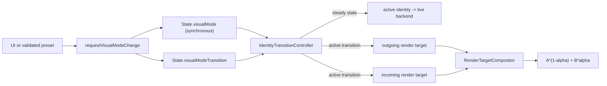

# Visual Identities

This document records the active visual identity system in `src/visuals/`.

## Purpose

Visual identities are deep visual modules. Each identity hides its own color theory, movement dynamics, network or polygon rules, and performance tradeoffs behind the same small contract:

```ts
export interface VisualIdentity {
    readonly id: string;
    readonly name: string;
    readonly usesSharedSimulation?: boolean;
    draw(backend: VisualRendererBackend, particles: Particle[], shockwaves: Shockwave[], context?: VisualIdentityDrawContext): void;
    syncPosition?(timeSec: number): void;
}
```

`PlexusRenderer` remains the render orchestrator. It synchronizes playback time, accepted analysis frames, beat and cue event indexes, modulation, visual tuning, and `VisualDirectorFSM` output. It does not contain mode-specific drawing branches. At the end of each draw cycle it delegates to `IdentityTransitionController`, which selects either the steady-state direct path or the renderer-owned transition path.


```mermaid
flowchart LR
    UI["UI or validated preset"] --> Request["requestVisualModeChange"]
    Request --> Mode["State.visualMode (synchronous)"]
    Request --> Record["State.visualModeTransition"]
    Mode --> Controller["IdentityTransitionController"]
    Record --> Controller
    Controller -->|"steady state"| Direct["active identity -> live backend"]
    Controller -->|"active transition"| Out["outgoing render target"]
    Controller -->|"active transition"| In["incoming render target"]
    Out --> Composite["RenderTargetCompositor"]
    In --> Composite
    Composite --> Live["A*(1-alpha) + B*alpha"]
```

`requestVisualModeChange()` is the only runtime writer of `State.visualMode`. It changes the logical selection immediately. When playback or offline export is active, it also writes one `VisualModeTransition` record (`from`, `to`, `generation`, `startTimeSec`, `durationSec`); paused/stopped changes clear the record and do not dual-render. The start is anchored to `State.currentTime` for playback and exact `State.exportTime` for export. Duration is clamped to `0.1..4.0` seconds.

`IdentityTransitionController` owns transition consumption and completion. `computeCrossfadeAlpha()` derives a smoothstep alpha from the song/export clock. Before the recorded start (including a backward time jump) or on completion, the controller clears the transition and draws only the incoming identity. A record that no longer targets the logical mode is bypassed. In steady state it does not call the compositor.

`P5RenderTargetCompositor` implements `RenderTargetCompositor` with exactly two constructor-allocated `p5.Graphics` targets. Active transition frames clear both targets, resize them only when the live surface size changes, and composite with Canvas2D `source-over`: outgoing at `1 - alpha`, incoming at `alpha`. Additive `lighter` blending is not part of identity replacement.

Shared particle/shockwave simulation advances exactly once per transition frame. Normally the incoming identity receives `advanceSharedSimulation: true` and the outgoing identity receives `false`. If the incoming identity does not declare `usesSharedSimulation`, ownership remains with a shared-simulation outgoing identity. Effects must honor the flag before updating or deleting shared pool entries.

## Visual Score Tuning Handoff

Visual identities do not parse or directly consume the Visual Score DSL. When
`featureFlags.semanticResolver` is enabled, the offline semantic chain produces
`ChoreographyFrame` values containing motif intensity/density/motion, novelty, and
typed transition endpoints. `SemanticResolver` translates the active frame into
clamped `State.targetTuning`; the existing tuning morph then exposes the result to the
selected identity through `State.visualTuning`.

This lets the same motif or transition influence each identity through its own tuning
vocabulary without coupling `src/semantics/` to renderer classes. Source and target
motif deltas are blended by transition progress. The fast audio-reactive channel is
unchanged: `VisualDirectorFSM` remains the sole owner of `State.modulation` and
`State.directorOutput`, and identities must not read `ChoreographyFrame` directly.

## Registry

`src/visuals/StyleRegistry.ts` owns registered styles behind a private `Map`. Its public API is intentionally small:

- `register(identity: VisualIdentity): void`
- `get(id: string): VisualIdentity`
- `createDefaultStyleRegistry(): StyleRegistry`

Unknown style ids fall back to the `classic` identity. If `classic` itself has not been registered, `get()` throws because the application has been composed incorrectly.

`createDefaultStyleRegistry()` registers the current built-in identities:

- `classic`
- `temporal`
- `dark-techno`
- `organic-ambient`
- `cyberpunk`
- `cosmic-wormhole`
- `hero` (registered only when `featureFlags.heroEffect` is enabled)

There is no module-level writable global registry. The app composes a registry instance in `src/main.ts` and passes it to `startPlexusRenderer()`.

## Built-In Identities

### Classic

File: `src/visuals/ClassicPlexusEffect.ts`

The original Plexus look: particle network, central glow, beat shockwaves, polygon flashes, and deterministic LOW_DROP glitch offsets. Color buffers are private fields on the identity instance, not module-level writable arrays.

### Temporal

File: `src/visuals/TemporalMusicEffect.ts`

A track-aware identity that consumes `TrackAnalysis` sections, recurring patterns, visual features, cues, and modulation to drive background tone, network density, polygon color, central mechanism rings, and pattern resonance. It keeps color buffers inside the identity object and passes numeric RGB components to ring drawing.

### Dark Techno

File: `src/visuals/DarkTechnoIdentity.ts`

Strict monochrome industrial language. It uses sharp white/gray line work, sparse high-brightness strobe polygon flashes, and disables `radialGlow` entirely to preserve a raw digital dark aesthetic.

### Organic Ambient

File: `src/visuals/OrganicAmbientIdentity.ts`

Slow, fluid, fog-like identity. It avoids sharp network lines and instead draws pastel green, blue, and earth-tone radial glow layers around particles so they blend into a soft field.

### Cyberpunk

File: `src/visuals/CyberpunkIdentity.ts`

High-contrast neon magenta and cyan identity. It simulates chromatic aberration by drawing connections twice with small offsets and uses deterministic high-tension glitch offsets during buildup/drop pressure.

### Cosmic Wormhole

File: `src/visuals/CosmicWormholeIdentity.ts`

A 3D "tunnel flight" identity. It maintains a fixed dust pool (one grain per spectral band and depth layer) in cylinder space: every grain has an angular position `theta`, a band assignment, and an immutable normalized `depthPhase`. Base travel is reconstructed from canonical song/export time and fixed-hop analysis at a calibrated `240` reference units/second. The prefix integrates the same pure `canonicalWormholeTravelSpeed()` used by `WormholeMotionProfile`; authored speed changes add a `96` units/second future-rate envelope through a fixed-capacity anchor timeline. Changing `wormholeSpeed` therefore preserves distance already travelled while materially changing future Z motion. The normalized depth phase uses the live horizon, so one cycle corresponds to the currently projected tunnel depth.

Music reactivity is sourced from precomputed state, never realtime DSP:

- The 24-band `State.currentFrame.perceptualSpectrum` is distributed around the tube wall, one angular sector per band, and each band's energy drives the brightness and thickness of its grains (a genuine per-grain signal, not a value shared by the whole field). Material response (alpha/stroke weight, never geometry) is live-dominant (`LIVE_GRAIN_SHIMMER = 0.88`): a band's own sector visibly lights up while it is active and dims when it is not, reading as a circular spectrograph, with only a small release-time grounding term so a grain never goes fully dark between spectrum frames. This is not a global pulse -- it is 24 independently reactive sectors -- and it is safe against the kick/bass "whole tube pumps" regression described below, since that regression is guarded by a wholly separate, still fully release-snapshotted mechanism that never reads this blend.
- Fixed-hop analysis supplies a deterministic music-aware base rate; `wormholeSpeed` adds a continuous future-rate envelope instead of multiplying past distance. `WormholeMotionProfile` adds bounded tempo, section, bass, density, and transient character, consumed as described below.
- `State.currentFeatures.vocal` and `melody` shift the grain hue through `hueToRgbInto()` with an identity-owned RGB tuple.

Tunnel geometry stays stable and does not breathe with the music. FOV, horizon (`maxZ`), and tube radius are driven only by the tuning controls plus `WormholeMotionProfile`'s slow, bar-scale `*Evolution` terms (bounded within a few percent, cycling over roughly a bar-multiple of seconds); the live, per-frame `perspectiveCompression`, `depthPulse`, and `densityFill` values are computed by the profile but are not read here, so a kick or bass hit cannot pump the FOV, horizon, or radius, and grain alpha/stroke weight no longer take a global `impact` (kick) or live density term either. All continuous, per-frame musical reactivity is routed through the per-grain release snapshot instead (next paragraph); `wormholeGrainFlowAngle`'s bass term likewise reads a release-time snapshot, never the live `motion.bassWarp`, so the whole tube cannot visibly swirl in sync on every bass frame.

Kick, bass, and LOW_DROP reactions are release-time attributes, not a continuous per-frame pull. Each grain's generation is an absolute floor of its unwrapped travel-distance position (`travelDistance / horizon - depthPhase`) — a pure function of current distance, never a frame-to-frame delta, so an arbitrarily large gap between draw calls (a stall, a huge seek, a low-FPS export tail) still yields the exact right generation and can neither skip nor double-count one. When it increases (the grain has just re-emerged at the far plane and started a new generation) the grain samples the current kick envelope, bass warp, density, authored jitter, and any active LOW_DROP envelope/variant exactly once and stores them (`releaseKick`, `releaseBass`, `releaseDensity`, `releaseJitter`, `releaseEmission`, `releaseVariant`, `releaseTrailScale`, `releaseDistance`, `releaseGeneration`). Every later frame reads only these stored scalars together with a monotonic decay keyed to travel distance since release (`wormholeKickReleaseEnvelope` / `wormholeBassReleaseEnvelope` / `wormholeLowDropReleaseEnvelope`); the decay only ever shrinks as the grain travels on, so a released grain settles once toward its unperturbed path instead of oscillating back and forth, and a later, unrelated kick, bass rise, or LOW_DROP event cannot retroactively tug a grain that already released. `syncPosition()` clears every grain's release scalars and sets `releaseGeneration` to the grain's true absolute generation at the new position (not to zero), so a seek cannot leave a stale reaction, a damaged generation count, or a spurious re-release on the very next frame.

The visual lens center stays stable, with no camera shake, roll, or horizon jump. `wormholeWarp` means local per-grain spiral/advection amount, and `wormholeCurve` means local per-grain flow curvature: each grain's swirl phase advances with its own forward depth progress, never with wall-clock time. Neither one bends the global route. `wormholePathBend` is a bounded target-heading authoring control, not an endless turn-rate command, screen-space tube bend, or lateral deformation. Runtime steering eases curvature toward that heading; lowering the value applies bounded counter-curvature, and zero monotonically restores the straight heading instead of retaining a previous spiral.

`sampleWormholeRouteFrame(distance, bend)` returns the canonical route-local travel frame: integrated route position, normalized tangent/normal, continuous heading angle, curvature, and turn intensity. Grain heads and tails sample route frames at their camera and point distances, transform the tube point into the camera-local frame, then project. The camera-local frame follows the route tangent without roll; the theta-independent route-curvature drift keeps the centerline lens-local without a heading-shear compensation term. Bend zero returns an exact straight baseline.

The scene is wrapped by a starfield plus a deeper layer of large, faint `radialGlow` galaxies (gated by `shouldUseExpensiveGlow`), plus an optional skybox. Background stars and galaxies use the same route-local travel frame as the foreground: current/previous camera frames and point frames determine parallax and trail direction, with near layers reacting more strongly through their own perspective divide. No background layer invents an independent random route, separate viewer-frame system, whole-cosmos rotation, or oversized shared background master scale. Stars and galaxies also fade alpha through their own near-plane zone via `wormholeNearPlaneVisibility()` and floor their own projection depth. `syncPosition()` reconstructs the canonical coordinate after seek/stop, so identical song positions reproduce identical geometry. `wormholeDepthCoherence` can deterministically compress immutable depth cohorts for authored rib character without restoring mutable depth damage; `wormholeRing` separately blends live depths toward discrete rings.

The clip preset family keeps ring alignment disabled except for collapse, which uses a restrained `0.35` ring amount. Sparse remains open (`wormholeRing = 0`) while nonzero depth coherence and long continuity retain a segmented/ribbed texture. Longer continuity values provide perspective and velocity without introducing new scene objects.

Projection safety is renderer-owned: the closest `1.5%` depth zone is culled, visibility smoothsteps to full strength by `5.5%` of the horizon, projected stroke weight is capped at `4.5`, and projected trails are capped at `22%` of viewport height. These guards apply after material and LOW_DROP amplification without suppressing normal near-plane crossings.

All pools and color tuples are allocated once in the constructor, glitch and parallax noise come from a deterministic `pseudoNoise()` hash, and drawing stays on `backend.line` plus the gated galaxy `radialGlow`.

### Hero

File: `src/visuals/HeroEffectIdentity.ts`

A timeline-forward identity built around a fixed playhead dot near the lower-left area of the screen. Beat event dots travel right-to-left along a horizontal lane near the bottom of the viewport. Dot positions are not updated by velocity or retained per-dot state; each X coordinate is computed directly from `event.time - State.currentTime`, making the identity deterministic, stateless, scrub-safe, seek-safe, and offline-export safe.

Hero reads `State.visualTuning.heroEventMode` to decide its event source. Mode `0` renders all accepted audio events from `State.events`. Mode `1` keeps the UI label "audio drums only" for compatibility, but its documented meaning is percussive/high-transient visual events from accepted `BeatEvent` entries, not literal drum stem detection. Mode `2` renders metronome beeps only. Audio-event dots that have reached or just passed the playhead disappear or produce a localized flash. Dot positions are deterministic from `event.time - State.currentTime`; dot size scales from `event.intensity` and `State.visualTuning.circleSize`. `event.type` is a visual impact category: type 1 uses the standard lane dot, type 2 dense impact events are larger and brighter, and type 3 fx/high-transient events are smaller, sharper, and magenta. The playhead and lane pulse from `State.modulation.rhythmicImpulse` / `State.beatDecay`, where Beat Impulse is the decaying renderer pulse from consumed accepted BeatEvents.

In metronome mode, Hero looks ahead mathematically into the timeline instead of reading rendered history. It calls `HeroMetronome.getBeepEventsInWindow(State.trackAnalysis, State.currentTime, State.currentTime + visibleSeconds)` to draw future events according to the active `PerformanceAutomationPlan` preset schedule. That helper resolves the scheduled preset's `heroBeepMode`, so upcoming dots reflect the automation plan before the playhead reaches them.

## UI And Presets

`State.visualMode` is a `VisualMode` union:

```ts
'classic' | 'temporal' | 'dark-techno' | 'organic-ambient' | 'cyberpunk' | 'cosmic-wormhole' | 'hero'
```

The visual mode select in `src/main.ts` exposes the built-in values; `cosmic-wormhole` is always available, while `hero` is listed only when `featureFlags.heroEffect` is enabled. `DashboardUI` validates mode ids through `isVisualMode()` and routes both user and preset changes through `requestVisualModeChange()`; no UI or effect module assigns `State.visualMode` directly. Older presets without `visualMode` remain valid and known built-in ids update the logical state and select element synchronously.

### Wormhole Tuning Group

`src/config/visualTuning.ts` exposes a dedicated `Wormhole` control group consumed by `CosmicWormholeIdentity`:

- `wormholeRadius`, `wormholeDepth`, `wormholeSpeed` — base tube diameter, horizon distance, and anchored future travel rate/trail velocity.
- `wormholeWarp` — local dust spiral/advection amount; it does not bend the global route.
- `wormholeCurve` — individual grain flow curvature (`0` removes that local curvature); it does not define the viewer route.
- `wormholePathBend` — controls a bounded, signed horizontal route target heading and its steering curvature (`0` is the exact straight camera-local target for both grains and backgrounds; positive/negative values mirror left/right direction), without shake, roll, canvas rotation, or horizon jumps. Grains and backgrounds use the same route-local travel frame before projection. Always reads effective live tuning, never a grain's frozen release snapshot; a curved-to-straight transition counter-steers continuously.
- `wormholePathBendVertical` — independently controls the signed vertical route component. Together with `wormholePathBend` it produces diagonal route drift while retaining the no-roll camera frame. Automation's `bendMirror` direction flag flips mirrorable authored bends before target application; it is not a second renderer multiplier.
- `wormholeRing` — blends the natural dispersed depth toward concentric rings (`0` = random, `1` = rings).
- `wormholeDepthCoherence` — deterministically compresses immutable depth cohorts (`0` = continuous distribution, `1` = strongest authored cohort character) without path-dependent damage.
- `wormholeContinuity` — scales projected streak length independently of ring alignment (`0` = dots, `1` = default trails, `2` = extended trails).
- Speed-scaled smear character (lens-overhaul plan T8, always on, not gated by `wormholeOpticsEnabled`): star/skybox streak length is scaled by a bounded `wormholeSmearRateGain` (1x-2.2x) driven by the canonical travel rate, on top of the existing linear `wormholeTrailSeparation`, so fast passages whip into longer continuous streaks instead of scaling purely linearly with speed. Inside the lens radius, a second bounded `wormholeLensSmearGain` (1x-1.65x, screen-space squared-distance gated) stretches throat-local streaks further; it never touches heading, route, travel phase, projection depth, or spectrum-driven geometry. The dust pool's own alpha/weight/trail ratios were also retuned (fine dust thinner and longer, sparse sparks' peak weight reduced) so the population reads as fine grain rather than fat dots at speed. Both changes affect every existing wormhole preset's default look immediately; they are not part of the `wormholeOpticsEnabled` wall/lens opt-in.
- `wormholeStarfield`, `wormholeGalaxy`, `wormholeSkybox` — user-global background layer masters for star density, the deep galaxy layer, and the optional skybox. Factory `vos-wh-*` presets do not write these keys, so a user-authored background balance survives wormhole role changes. Automation-triggered presets with an explicit foreign `visualMode` are filtered by the identity tuning registry before they can write wormhole-owned keys. Manual preset loading and `visualMode`-less presets remain backward compatible.
- `wormholeOpticsEnabled` — boolean-style `0`/`1` master switch for the complete wall/lens parameter family. It defaults to `0` (`Off`) and snaps rather than morphing fractionally. While Off, `wormholeWall`, all five wall sub-controls/material selection, and `wormholeLens`/radius/swirl have no render effect; the lens warp, refraction field, vignette, Einstein glow, and F5 ring tint all take their true bypass paths. The factory `default.json` explicitly resets it to Off, while `vos-wh-*` role presets deliberately leave it user-global so switching wormhole roles does not undo an explicit opt-in.
- `wormholeWall` — master intensity for the *drawn* refractive membrane wall layer: a rippling membrane grid, Fresnel edge, chromatic refraction fringe, event-driven pressure waves, and a caustic hero layer, framing the tunnel behind the grain field. `0` fully skips the layer entirely (no geometry sampled, no lines drawn) and is the factory default and every `vos-wh-*` preset's authored value as of the true-lens plan (F4) -- these drawn line materials are now a legacy/stylized opt-in, not the wall's default presentation. With `wormholeOpticsEnabled=1`, the wall's presence instead reads through a bounded (≤8%) perturbation of the gravitational lens's own Einstein radius (see `wormholeLens` below): an azimuthal ripple plus a kick/LOW_DROP temporal swell, reusing the exact same `wormholeWallRippleOffset`/`wormholeWallWaveOffset` evaluators the drawn materials always used, active whenever `wormholeLens > 0` regardless of `wormholeWall` itself.
- `wormholeWallRefraction` — intensity of the chromatic refraction fringe: a warm/cool split rendered only on the brightest ~20-30% of a segment's live sector energy, gated to zero whenever this value is `0`. Forced to `0` in performance mode regardless of the authored value.
- `wormholeWallCaustics` — intensity of the caustic hero layer: 4-6 analytic helix polylines drawn on top of the membrane grid, reusing each ring's already-sampled route frame (no extra route sampling). Brightness reuses the same live sector-energy mapping the membrane segments use. Performance mode caps the helix count from 5 to 2. (The caustic's own glow companion, a `radialGlow` echo along the helix, was removed in the true-lens plan F4 -- it read as a "dot chain" running along the spiral.)
- `wormholeWallWaves` — intensity of event-driven kick/LOW_DROP pressure-wave fronts. Up to 3 fronts (one reserved for a live LOW_DROP, the rest for the most recent qualifying kicks within a bounded lookback window) each contribute a bounded, Gaussian-shaped radius bump that travels outward with age -- kick fronts move narrow and fast, LOW_DROP fronts move wide and slow. In the default membrane material this shares the exact radius channel `wormholeWallRippleOffset` uses (never scaled by the `wormholeWall` master, matching how ripple itself isn't); in the pixel-mosaic material (see `wormholeWallMode` below) the same bounded front value instead drives a per-cell *angular* shift, since discrete cells have no ripple/radius concept. With no qualifying event nearby the contribution is exactly zero either way.
- `wormholeWallCracks` — intensity of a small (7), pre-generated, deterministic crack pool that flashes only under an active kick/LOW_DROP pressure front -- reusing the exact same fronts `wormholeWallWaves` gathers, never a second event source. Each crack is a short fixed jagged polyline (4-8 points) in the wall's own (theta, depth) space, permanently assigned to react to kick-only, LOW_DROP-only, or either kind of front, with its own admission threshold so the family doesn't all flash on every single event. Chromatically split using the same warm/cool colors and `wormholeWallRefraction` gate the membrane's own fringe uses. Fully disabled in performance mode, independent of which base material (`wormholeWallMode`) is active.
- `wormholeWallMode` — discrete wall material switch: `0` (default) the rippling membrane grid described above, `1` a coarser pixel-mosaic material -- a depth x angle grid of short, unfilled tick marks (24 cells per ring, one per spectral band) instead of a continuous circumference. Tick brightness reuses the same live sector-energy mapping the membrane uses; caustics are not drawn on this material (smooth analytic helices would read as inconsistent against a blocky digital grid), while cracks and pressure waves (as a cell-shift) still apply. This is a hard structural switch, not a blend, so it joins `performanceMode`/`chromaKeyMode` in the tuning morph's snap-list instead of interpolating through a meaningless in-between value. No factory `vos-wh-*` preset enables it -- it is opt-in only, for a future dedicated preset.
- `wormholeLens` — master intensity of the post-projection, screen-space gravitational warp applied to the skybox, starfield, and galaxy layers. `0` takes the exact identity path; nonzero values bend both endpoints of each streak around the route-following throat center without changing route, camera, depth, or travel phase.
- `wormholeLensRadius` — radius of the lens field as a fraction of the screen half-diagonal. It controls the scale shared by deflection, throat-local smear, the Einstein-ring accumulation, and the optional dark-glass vignette rather than changing tunnel geometry.
- `wormholeLensSwirl` — azimuthal rotation layered over radial deflection. It is authored strongly for impact/transition clips (`collapse`, `punch`) and kept low for quiet clips so the family can move between a stable reveal and a violent corkscrew without stateful animation.
- F5 adds `compositeRingTint`: one full-annulus `screen` exposure breath plus two (performance mode) or three broad `saturation` sectors around the Einstein radius. Sector energy is averaged from 24 bands over an eight-frame canonical analysis window, so playback, seek, and export produce the same result without frame-delta state. Chroma-key modes skip the effect completely, and the backend restores `source-over` after every composite call.
- Every `vos-wh-*` clip preset explicitly authors all five continuous wall keys, the material mode, and all three lens keys instead of relying on global defaults; `wormholeOpticsEnabled` remains a separate user-global opt-in. As of the true-lens plan (F4), `wormholeWall` itself is uniformly `0` across the family (the drawn line materials are legacy/opt-in everywhere); the remaining wall sub-keys and the three lens keys still carry the family's role-specific character: `sparse` is the quietest lens treatment, `establish` and `galaxy` are the strong reveal lenses, `collapse` and `punch` carry the strongest swirl and pressure-wave accents, and `galaxy` remains the widest caustic/lens showcase.
- The preset palette is deliberately split: establish/drive/drift/sparse/dissolve/collapse/galaxy use a low-key blue-to-blue-white hue family for the cinematic lens read, while `punch` and `overdrive` retain their authored magenta impact identity; `spiral` remains blue-violet as the bridge between them. The renderer keeps the Einstein-ring and caustic highlights at low saturation even when the base grain hue is more chromatic.

The Visual OS dramaturgy drives this identity through a dedicated clip preset family and
action vocabulary; see [wormhole-clip-profile.md](wormhole-clip-profile.md). The clip
presets pin `visualMode` to `cosmic-wormhole`, explicitly carry their route/grain wormhole role keys (including membrane-wall and lens controls), and leave background masters global.

## Render Boundary And Performance Rules

- Identities must draw only through `VisualRendererBackend`.
- Identities must not create, retain, resize, clear, or composite render targets and must not call `RenderTargetCompositor`; composition is renderer-owned.
- Identities must not write `State.visualMode` or `State.visualModeTransition`, and shared-pool identities must honor `advanceSharedSimulation`.
- Direct p5 drawing belongs in `P5RendererBackend`, `Particle`, `Shockwave`, or `PlexusRenderer` setup/lifecycle code.
- Do not allocate p5 vectors, particles, shockwaves, or unbounded persistent objects inside identity draw paths.
- Hot color conversion should use `hueToRgbInto()` with identity-owned RGB tuples.
- Random-looking glitch behavior must be deterministic from indexes, salts, playback phase, and modulation state; do not use nondeterministic randomness inside identity draw loops.

## Validation

`tests/styles-deterministic.test.mjs` creates a browser-free, p5-free deterministic render harness. It loads the TypeScript visual modules in a VM, uses a mock `VisualRendererBackend`, mock particles, and mock shockwaves, and simulates 60 frames for every built-in identity across five genre reference profiles:

- Peak Time Techno, 128 BPM
- Organic House / Ambient, 90 BPM
- IDM / Breakbeat, 140 BPM
- Industrial Techno, 150 BPM
- Cinematic Ambient, 70 BPM

The test asserts that no identity crashes in intro, buildup, drop, or break phases and that backend draw-call counts are deterministic across repeated runs.

`tests/visual-mode-transition.test.mjs` covers alpha boundaries, synchronous mode switching, playback/export clock anchoring, duration clamps, compositor blend/clear rules, transition-only dual rendering, shared simulation gating, and the single runtime writer for `State.visualMode`. `tests/wormhole-depth-integrity.test.mjs` covers immutable phase uniformity under moving horizons, deterministic coherence, repeated seeks, and identical post-seek tunnel/galaxy geometry; `tests/wormhole-lifecycle.test.mjs` covers automation re-arming after backward seek.
